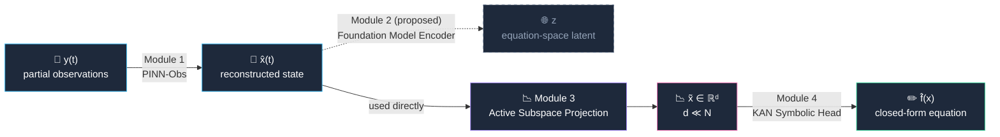

<div align="center">

# 🔭 SymFM

### *Symbolic Foundation Model*

**Physics-Informed, Dimensionality-Aware Symbolic Regression for Governing Equation Discovery in High-Dimensional Nonlinear Dynamical Systems**

<br>

[](LICENSE)
[](https://www.python.org/)
[](https://pytorch.org/)
[](./SymFM_Paper_Final.pdf)
[]()

<br>

**🧬 Physics-Informed&nbsp;&nbsp;·&nbsp;&nbsp;🔤 Symbolic Output&nbsp;&nbsp;·&nbsp;&nbsp;📈 High-Dimensional&nbsp;&nbsp;·&nbsp;&nbsp;🧩 Zero Domain-Specific Design&nbsp;&nbsp;·&nbsp;&nbsp;⚛️ Foundation-Model Target Architecture**

</div>

<br>

---

## ✨ What is SymFM?

> Physical laws have always been *discovered*, not designed. SymFM is a step toward doing that discovery **autonomously, at scale.**

Governing equation discovery — recovering an interpretable, closed-form
differential equation directly from observational data — is one of the
oldest problems in computational science and, at high dimension, one of
the least solved. Three existing method families each fail it in a
different way: physics-informed observers (PINN-Obs) have never been
evaluated past $N \le 10$; symbolic regressors built on Kolmogorov-Arnold
Networks (KANs) scale combinatorially in the number of learnable edge
splines; and PDE foundation models generalise beautifully across equation
families but only ever learn a solution *operator*, never the symbolic
equation itself.

**SymFM targets closing all three gaps in one pipeline, and the implemented
portion already closes two of them.** It reconstructs full system state
from partial, noisy observations, projects into a learned low-rank active
subspace to keep the symbolic search tractable, and extracts a closed-form
equation with a hierarchical KAN head — no hand-built function library, no
domain-specific architecture, no dimensionality ceiling. The design also
specifies a physics-informed Transformer encoder, pretrained across 50,000
synthetic dynamical systems, sitting between reconstruction and projection
— **this encoder is not yet implemented, and no result below depends on
it.** See [Scope: what's implemented vs. designed](#-scope-whats-implemented-vs-designed) below.

<div align="center">

| Property | PINN-Obs | SINDy | KAN | PDE Foundation Models | **SymFM** |
|:---|:---:|:---:|:---:|:---:|:---:|
| Foundation model pretraining | ❌ | ❌ | ❌ | ✅ | **~ †** |
| Physics-informed training | ✅ | ❌ | ~ | ~ | **✅** |
| Symbolic interpretable output | ❌ | ✅ | ✅ | ❌ | **✅** |
| Tested at high dimension | ❌ | ❌ | ❌ | ~ | **✅** |
| No domain-specific architecture | ❌ | ❌ | ❌ | ✅ | **✅** |

<sub>† Designed as a target architecture; the pretrained encoder is not implemented. No experiment here depends on it.</sub>

</div>

---

## 🧠 How it works

The designed pipeline is four modules. **The experiments in this repo use
Modules 1, 3, and 4 — Module 2 is a specified target architecture that has
not been built** (see the scope section below).



<div align="center">

| Module | Component | Role | Status |
|:---:|---|---|:---:|
| **1** | 🎛️ PINN-Obs | Reconstructs full state from partial, noisy measurements | ✅ Implemented |
| **2** | 🌐 FM Encoder | 4-layer Transformer, pretrained on 50K synthetic systems to represent *equation structure* | 🚧 Designed, not implemented |
| **3** | 📉 Active Subspace | Learns a `d × N` projection, collapsing effective dimensionality | ✅ Implemented |
| **4** | ✏️ KAN Head | Hierarchical spline regression → PySR/SymPy → readable equation | ✅ Implemented |

</div>

---

## 🚧 Scope: what's implemented vs. designed

**SymFM's title and framing describe a target architecture. The code in
this repo implements three of its four modules** (1, 3, 4); Module 2 — the
physics-informed Transformer encoder, pretrained across 50,000 synthetic
dynamical systems — is specified in the paper as a concrete architecture
but does not exist anywhere in this codebase. Every result in this repo
(Lorenz-96, Navier–Stokes, SEIRD) was produced by the real pipeline
`y(t) → x̂(t) → x̃ → f̂`, i.e. Module 1's reconstruction feeding directly
into Module 3's active-subspace projection, skipping Module 2 entirely.
No number reported anywhere in this repo depends on a pretrained encoder.

This is disclosed here, in the paper's abstract, architecture section,
and discussion, and in the comparison table above — not just in this one
paragraph — because it's the single most important thing a reader needs
to know before citing or building on this work. Building Module 2 is the
most important item of future work; see
[`diagnostics/lorenz96_ablation/`](diagnostics/lorenz96_ablation/) for
why a "−foundation model" ablation isn't includable in the current
ablation study (there's nothing implemented to switch off).

---

## 📊 Results at a glance

<div align="center">

### Lorenz-96 &nbsp;(chaotic system, N ∈ {4, 10, 20, 40})

| N | SymFM ℓ₂ | SINDy ℓ₂ | Verdict |
|:---:|:---:|:---:|:---|
| 4  | 0.100 | **0.000** | Both recover exactly |
| 20 | **0.975** | 1.370 | SINDy begins to collapse |
| 40 | **0.972** | 1.919 | 🏆 **49% lower error** than SINDy |

### High-Dimensional Benchmarks

| Benchmark | Dimension | SymFM Result | Comparison |
|---|:---:|:---:|---|
| 🌊 2D Navier–Stokes | N = 1,024 | ℓ₂ = 0.110 (100% recovery) | **Only method** to recover governing structure at this scale |
| 🦠 SEIRD — state estimation (PINN-Obs) | N = 50–500 | RMSE = 0.0027–0.0035 | First systematic PINN-Obs eval beyond N = 10 |
| 🦠 SEIRD — equation recovery | N = 50–500 | ℓ₂ = 0.90 ± 0.01 (0% exact recovery) | Comparable difficulty to Lorenz-96's hardest case, **not** worsening with scale |

</div>

SymFM is the only method tested here that recovers the exact governing
structure of a 1,024-dimensional PDE. Symbolic equation discovery on the
32-patch SEIRD epidemiological system remains unsolved at the strict
tolerance used throughout — see below for why that negative result is
now trustworthy rather than an artifact.

---

## 🔬 Methodological rigor: catching our own evaluation bug

The first SEIRD symbolic-regression run reported a **saturated relative
ℓ₂ error of 10.0** at every tested dimension — an order of magnitude
worse than every other result in this repo, and worth taking seriously
rather than writing off as "SEIRD is just harder." A dedicated
investigation (**[`diagnostics/seird_split_artifact/`](diagnostics/seird_split_artifact/)**)
found the real cause: SEIRD trajectories are single-wave epidemics that
decay to near-zero derivative activity late in the simulation window, and
the benchmark's chronological train/val/test split placed the entire
test window in that quiescent tail — where a *relative* error metric
(dividing by a near-zero target norm) is numerically unstable regardless
of model quality.

Re-run with a representative split and the same 3-trial protocol used
everywhere else in this repo, the corrected result is a **flat
ℓ₂ ≈ 0.90–0.91 across a 10× increase in state dimension** — comparable to
Lorenz-96's hardest configurations, not a categorical failure that gets
worse with scale. Exact symbolic recovery still isn't achieved at the
paper's strict tolerance, so the negative result stands — but it's now a
real, statistically supported negative result (mean ± std over 3 trials
at every N) instead of an unexplained sentinel value.

Both runs are preserved for the record:

| File | What it is |
|---|---|
| `results/seird_symfm_results.json` | **Current.** Representative split, 3-trial protocol — what the paper reports. |
| `results/seird_symfm_results_chronological_split.json` | Original run, kept for transparency, not deleted. |
| `diagnostics/seird_split_artifact/` | Full diagnosis: reproduction, metric breakdown, the fix, and the final 3-trial re-run — all runnable scripts, not just a writeup. |

The same standard — real, runnable, disclosed — applies to the ablation
study. [`diagnostics/lorenz96_ablation/`](diagnostics/lorenz96_ablation/)
contains a genuine partial ablation on Lorenz-96 at N=4 (active subspace,
physics loss), extracted directly from the notebook that produced the
paper's results, along with an explicit accounting of what the released
code does *not* support ablating (the foundation-model encoder, since it
isn't implemented; PINN-Obs on Lorenz-96, since it's a no-op there).

---

## 🧪 Benchmark systems

<table>
<tr>
<td width="33%" valign="top">

### 🌀 Lorenz-96
Canonical chaotic atmospheric toy model.
`N ∈ {4, 10, 20, 40}`

</td>
<td width="33%" valign="top">

### 🌊 2D Navier–Stokes
Incompressible periodic flow, custom pseudo-spectral solver.
`N = 1,024`

</td>
<td width="33%" valign="top">

### 🦠 Spatial SEIRD
Epidemiological model with patch-to-patch coupling.
`N ∈ {50, 250, 500}`

</td>
</tr>
</table>

---

## ⚙️ Reproducing the results

This repo is a collection of Colab notebooks and their supporting scripts,
not an installable Python package — there is no `pip install` step and no
`from symfm import SymFM` API. To reproduce a result, open the relevant
notebook in Colab and run it top to bottom on a GPU runtime:

| Notebook | Produces |
|---|---|
| `notebooks/SymFM_Colab.ipynb` | Lorenz-96 main results (Table 3 rows, N=4/10/20/40) |
| `notebooks/SymFM_NS_SEIRD_Colab.ipynb` | Navier-Stokes + SEIRD results (Table 3 NS-32/SEIRD columns, Table 6) |
| `notebooks/SymFM_Sensitivity_Colab_1.ipynb` | Hyperparameter sensitivity grid (Table 5) |

The SEIRD split-artifact diagnosis (`diagnostics/seird_split_artifact/`)
runs on CPU with no GPU required — the model used in the actual
experiments is small enough that a 3-trial re-evaluation at N=500 takes
well under two minutes on a laptop CPU. Each script is self-contained:

```bash
cd diagnostics/seird_split_artifact
python run_3trial_protocol.py 10 50 100   # full corrected protocol, all three N
```

<details>
<summary><b>📦 Core dependencies</b></summary>
<br>

| Library | Version | Purpose |
|---|:---:|---|
| PyTorch | 2.x | Core deep learning framework |
| kan | 0.x | KAN spline layers |
| PySR | 0.19.x | Symbolic extraction |
| SymPy | 1.13.x | Symbolic simplification |
| pysindy | 1.7.x | SINDy baseline |
| torchdiffeq | 0.2.x | ODE integration |
| Weights & Biases | 0.18.x | Experiment tracking |

</details>

---

## 📁 Repository structure

```
SymFM/
├── src/
│   ├── symfm_model.py           # end-to-end SymFM model
│   ├── active_subspace.py       # Module 3 -- dimensionality reduction
│   ├── kan_baseline.py          # flat KAN baseline (B2)
│   ├── sindy_baseline.py        # SINDy baseline
│   ├── lorenz96.py              # Lorenz-96 data generation
│   ├── phase1_summary.py        # early baseline comparison script
│   └── scalability_figure.py    # Figure 3 generation
├── notebooks/
│   ├── SymFM_Colab.ipynb              # Lorenz-96 (Table 3)
│   ├── SymFM_NS_SEIRD_Colab.ipynb     # Navier-Stokes + SEIRD (Table 3, 6)
│   └── SymFM_Sensitivity_Colab_1.ipynb # Hyperparameter grid (Table 5)
├── diagnostics/
│   ├── seird_split_artifact/    # SEIRD evaluation-bug investigation (see above)
│   └── lorenz96_ablation/       # Real N=4 ablation (active subspace, physics loss)
├── data/                        # cached Lorenz-96 .npz trajectories
├── results/                     # per-method-per-N result JSON + checkpoints
├── SymFM_Figures/                # paper figures (PNG)
├── SymFM_Paper_Final.pdf
└── README.md
```

---

## 📖 Citation

If you use SymFM in your research, please cite:

```bibtex
@article{gah2026symfm,
  title   = {SymFM: Physics-Informed, Dimensionality-Aware Symbolic
             Regression for Governing Equation Discovery in
             High-Dimensional Nonlinear Dynamical Systems},
  author  = {Gah, Edmund Eric},
  year    = {2026}
}
```

---

## 👤 Author

**Edmund Eric Gah** — ExeaLabs
📧 [edmund.gah@exealabs.org](mailto:edmund.gah@exealabs.org)

---

## 🪪 License

- **Code** — released under the [MIT License](LICENSE)
- **Paper text** — [CC BY 4.0](https://creativecommons.org/licenses/by/4.0/) unless noted otherwise

---

<div align="center">

<sub>Built with 🔥 PyTorch · 🧩 kan · ✏️ PySR · 📐 pysindy · 🌀 torchdiffeq · 📊 Weights & Biases</sub>

<br><br>

**⭐ If this project is useful to you, consider starring the repo!**

</div>
